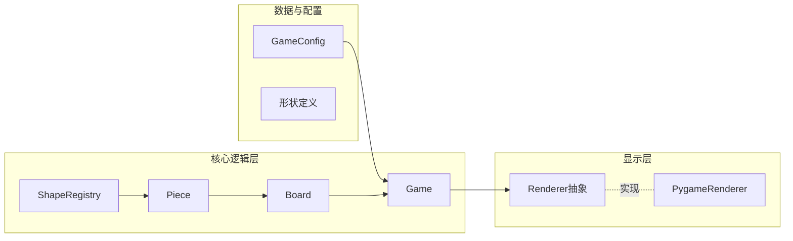

# Python 俄罗斯方块小游戏 - 类设计与实现计划

## 架构概览

核心思路：**游戏逻辑与显示分离**（依赖倒置），**形状可扩展**（开闭 + 注册），**配置与代码分离**，便于测试与更换前端。

---

## 1. 目录与文件结构

建议在项目下新增：

- `tetris/` — 游戏包
  - `__init__.py` — 导出公开类与入口
  - `config.py` — 配置与常量
  - `shapes.py` — 形状数据与注册
  - `piece.py` — 当前方块
  - `board.py` — 网格与消行
  - `game.py` — 游戏主控
  - `renderer.py` — 渲染抽象与 Pygame 实现
- `tetris/main.py` 或项目根目录 `run_tetris.py` — 启动脚本
- `requirements.txt` — 依赖（如 `pygame`）

---

## 2. 类定义与职责

### 2.1 配置与常量 — `config.py`

- **GameConfig**（dataclass 或 pydantic）
  - 网格行数、列数
  - 初始下落间隔（毫秒或帧）、每等级加速量
  - 方块像素大小（供渲染）、预览区列数
  - 从字典/YAML 加载的工厂方法，未提供项用代码内默认值
- **Constants**
  - 默认网格尺寸（如 20×10）、颜色名到 RGB 的映射等只读常量

职责：集中配置，与代码分离，便于测试与调参。

---

### 2.2 形状与注册 — `shapes.py`

- **ShapeDefinition**（dataclass）
  - `shape_id: str` — 唯一标识（如 `"I"`, `"O"`, `"T"`）
  - `display_name: str` — 展示名
  - `rotations: tuple[tuple[tuple[int, int], ...], ...]` — 各旋转状态下的相对坐标列表（每个旋转是一个“相对格点列表”）
  - `color: tuple[int, int, int]` — RGB
- **ShapeRegistry**（注册中心，单例或类属性字典）
  - `register(definition: ShapeDefinition) -> None`
  - `get(shape_id: str) -> ShapeDefinition`
  - `all_ids() -> list[str]`
  - 在模块加载时注册标准 7 种方块（I, O, T, S, Z, J, L），符合开闭原则：新增形状只需新数据 + 注册，不改核心逻辑。

职责：统一管理所有方块形状，供 Piece 按 id 创建。

---

### 2.3 当前方块 — `piece.py`

- **Piece**
  - 属性：`shape_id: str`、`rotation_index: int`、`x: int`、`y: int`（网格坐标，通常为左上或中心依约定）
  - 依赖：通过 `ShapeRegistry.get(shape_id)` 取 `ShapeDefinition`
  - 方法：
    - `cells() -> list[tuple[int, int]]` — 当前旋转下在**世界坐标**下的格点列表 `(row, col)`
    - `rotate_cw() / rotate_ccw()` — 改变 `rotation_index` 并返回 self（或新实例，依你偏好）
    - `move(dx, dy)` — 平移
    - `copy() -> Piece` — 用于碰撞前的试探（如旋转/移动前预测）

职责：表示当前下落中的一块，只负责形状、旋转与位置，不关心网格与消行。

---

### 2.4 网格与消行 — `board.py`

- **Board**
  - 属性：`rows: int`、`cols: int`、`grid: list[list[int | None]]`（或 `list[list[Optional[str]]]` 用 color_id 表示），由 `GameConfig` 提供尺寸
  - 方法：
    - `place(piece: Piece) -> None` — 将 piece 的格点写入 grid，格点存 color_id 或固定值
    - `clear_row(row: int) -> None` — 消除一行并下压
    - `clear_full_rows() -> int` — 检测并消除所有满行，返回消除行数（用于计分）
    - `collides(piece: Piece) -> bool` — 判断 piece 是否与已固定块或边界重叠
    - `is_valid(piece: Piece) -> bool` — 所有格点在范围内且不与已固定块重叠（与 collides 相反，命名可二选一统一）
    - `reset() -> None` — 清空 grid，用于新局

职责：唯一持有“已固定方块”状态，负责碰撞检测与消行，不关心分数与计时。

---

### 2.5 游戏主控 — `game.py`

- **Game**
  - 属性：`config: GameConfig`、`board: Board`、`current_piece: Piece | None`、`next_piece: Piece | None`、`score: int`、`level: int`、`lines_cleared: int`、`game_over: bool`
  - 依赖：`ShapeRegistry`（用于随机生成下一块）、`Board`、`GameConfig`
  - 方法：
    - `tick() -> bool` — 一次时钟步：尝试将当前块下移一格；若不能则固定并生成新块，消行、更新分数与等级；若新块放不下则设 `game_over`；返回值可表示“是否需要重绘”或“是否已固定”
    - `move_left() / move_right() / rotate_cw() / rotate_ccw()` — 若合法则修改 `current_piece`
    - `hard_drop() -> int` — 瞬间落底并固定，返回下落行数（可用来加分）
    - `restart() -> None` — 重置 board、分数、等级、当前/下一块、game_over
    - `get_state_for_render() -> ...` — 返回供渲染的只读视图（board.grid、current_piece、next_piece、score、level、game_over），避免渲染层直接改游戏状态（迪米特法则）

职责：协调 Board 与 Piece，驱动计时、计分、等级与胜负，不直接依赖具体渲染实现。

---

### 2.6 渲染层 — `renderer.py`

- **Renderer**（抽象基类 / Protocol）
  - 方法：`draw(game_state) -> None`、`run_loop(game: Game) -> None`（主循环：处理输入、调用 `game.tick()`/move/rotate、调用 `draw`、控制帧率）
  - 不依赖具体 Game 实现细节，只依赖“可获取状态”的接口（如 `get_state_for_render()`）。
- **PygameRenderer(Renderer)**
  - 依赖：`pygame`、`GameConfig`（窗口与格子尺寸）
  - 实现：窗口与格子绘制、键盘事件映射到 `game.move_*` / `rotate_*` / `hard_drop`、`game.tick()` 与计时（按 level 调节下落间隔）、显示分数/等级/下一块预览/Game Over

职责：唯一与 pygame 耦合的模块，便于将来增加 TerminalRenderer 或其它前端而不改 Game/Board。

---

## 3. 数据流与调用关系

- 主入口：加载 `GameConfig` → 创建 `Game` → 创建 `PygameRenderer` → `renderer.run_loop(game)`。
- 每帧：Renderer 处理输入 → 调用 `game.move_*` / `rotate_*` / `hard_drop`；定时或每帧调用 `game.tick()`；`state = game.get_state_for_render()` → `draw(state)`。
- 计分：在 `Game.tick()` 内根据 `board.clear_full_rows()` 的返回值与 level 计算加分，并可选提升 level 以缩短 tick 间隔。

---

## 4. 与项目规范的对应

- **单一职责**：Board 只管网格与消行，Game 只管流程与分数，Piece 只管形状与位置，Renderer 只管显示与输入。
- **开闭原则**：新形状通过 `ShapeDefinition` + `ShapeRegistry.register` 扩展；新显示方式实现 `Renderer` 即可。
- **依赖倒置**：Game 依赖“可读状态”的抽象，Renderer 依赖 Game 的公开方法而非内部实现。
- **配置分离**：`GameConfig` 从文件或字典加载，默认值在代码中。
- **PEP 8、类型注解、docstrings**：所有公开类与方法使用类型注解与简短 docstring；符合 python.mdc。

---

## 5. 每个设计与对应的 MDC 规则

以下将本方案中的设计点逐一对应到项目中的规则文件：  
`rules.general.mdc`（通用规范）、`rules.design-principles.mdc`（设计原则）、`rules/python.mdc`（Python 规范）。

| 设计项                              | 具体设计                                                                                               | 对应的 MDC 与规则条文                                                                                                   |
| -------------------------------- | -------------------------------------------------------------------------------------------------- | --------------------------------------------------------------------------------------------------------------- |
| **目录与文件结构**                      | `tetris/` 按功能分模块（config、shapes、piece、board、game、renderer），根目录入口与 `requirements.txt`                | **general**：分层组织、模块化、适当嵌套、资源分类、依赖管理、约定优先；**design-principles**：命名与结构约定（类名大驼峰、文件小写+下划线，放置：公共常量/抽象基类在核心模块）。       |
| **GameConfig / 配置**              | `GameConfig` 从字典或 YAML 加载，未配置项用代码内默认值；Constants 只读                                                 | **design-principles**：配置与代码分离、配置（层级化、默认值在代码、支持路径/对象传入）；**general**：资源分类（区分配置与代码）。                               |
| **ShapeRegistry / 形状注册**         | 注册中心 + `ShapeDefinition`，`register`/`get`/`all_ids`，模块加载时注册 7 种标准块；新增形状只加数据并注册                     | **design-principles**：注册机制（中心 + 显式 API、唯一 ID 与展示名、新增不修改注册中心或编排器）；开闭原则（扩展点、不修改核心流程）。**general**：设计模式（注册机制、开闭原则）。 |
| **Piece**                        | 只负责形状、旋转与位置；`cells()`、`rotate_*`、`move`、`copy()`                                                   | **design-principles**：单一职责（一个类只做一类事）；**general**：可测试性、单一职责原则。                                                   |
| **Board**                        | 唯一持有已固定方块状态；`place`、`collides`、`clear_full_rows`、`reset`                                           | **design-principles**：单一职责；**general**：可测试性、单一职责。                                                               |
| **Game**                         | 协调 Board 与 Piece，计分与等级；通过 `get_state_for_render()` 向渲染层提供只读状态，不暴露内部引用                              | **design-principles**：迪米特法则（只与直接依赖交互，通过统一接口获取数据）；依赖倒置（Renderer 依赖 Game 的公开接口）；**general**：单一职责、设计模式。            |
| **Renderer 抽象 + PygameRenderer** | `Renderer` 抽象基类/Protocol，`PygameRenderer` 实现；仅渲染与输入依赖 Game 的公开方法                                   | **design-principles**：依赖倒置（依赖抽象）、里氏替换（子类可替换基类）、接口隔离（只依赖用到的能力）；**general**：设计模式（依赖倒置、里氏替换）。                      |
| **数据与单一数据源**                     | 网格状态仅由 Board 持有；形状数据仅由 ShapeRegistry 统一提供                                                          | **design-principles**：数据与资源不重复消费（单一管理者、按 key 缓存/获取）；**general**：DRY、模块化。                                        |
| **命名与放置**                        | 类名大驼峰（GameConfig、Piece、Board、ShapeRegistry）；文件小写+下划线（config.py、shapes.py）；扩展项以职责结尾（PygameRenderer） | **design-principles**：命名与结构约定；**general**：命名规范、风格一致。                                                            |
| **类型注解与 docstrings**             | 所有公开类与方法使用类型注解与简短 docstring                                                                        | **python.mdc**：类型注解、docstrings；**general**：注释文档。                                                                |
| **数据模型**                         | `GameConfig`、`ShapeDefinition` 等用 dataclass（或 pydantic）表示                                          | **python.mdc**：使用 dataclasses 或 pydantic 模型表示数据。                                                                |
| **风格与测试**                        | PEP 8；pytest 对 Board/Piece/Game 做单元测试                                                              | **python.mdc**：PEP 8、pytest 与测试覆盖率；**general**：可测试性、风格一致。                                                       |
| **依赖与资源**                        | `requirements.txt` 集中管理依赖；若涉及文件则用上下文管理器                                                            | **python.mdc**：requirements.txt、上下文管理器；**general**：依赖管理、利用生态。                                                   |
| **异常与边缘情况**                      | 碰撞与边界判断、配置缺失时的默认值、Game Over 与 restart                                                              | **general**：异常处理；**python.mdc**：异常处理保证健壮性。                                                                      |

### 按 MDC 文件汇总

- **rules.general.mdc**：项目结构规则（分层、模块化、资源分类、依赖管理）；通用开发原则（可测试性、DRY、命名、注释、风格、设计模式、异常处理）。
- **rules.design-principles.mdc**：SOLID 与补充（单一职责、开闭、里氏替换、接口隔离、依赖倒置、迪米特法则）；注册机制；配置与代码分离；数据单一管理者；命名与结构约定。
- **rules/python.mdc**：PEP 8、类型注解、requirements.txt/venv、docstrings、SOLID、异常处理、dataclasses/pydantic、pytest。

---

## 6. 实现顺序建议

1. **config.py** — `GameConfig`、Constants
2. **shapes.py** — `ShapeDefinition`、`ShapeRegistry`，注册 7 种标准块
3. **piece.py** — `Piece`（含 `cells()`、旋转、平移、copy）
4. **board.py** — `Board`（grid、place、collides、clear_full_rows、reset）
5. **game.py** — `Game`（tick、move、rotate、hard_drop、get_state_for_render、restart）
6. **renderer.py** — `Renderer` 抽象、`PygameRenderer` 实现
7. **入口与依赖** — `run_tetris.py`、`requirements.txt`（pygame）
8. （可选）简单 pytest：对 Board 的 collides/clear_full_rows、Piece 的 cells/rotate、Game 的 tick 做单元测试

---

## 7. 依赖

- **pygame**：用于窗口、绘图与键盘输入（版本可用 `>=2.5.0` 或与当前环境兼容的版本）。
- 标准库：`random`（生成下一块）、`dataclasses` 或 `typing`。

若你希望**零 GUI 依赖**，可改为实现 `TerminalRenderer`（如用 `curses` 或纯 print 刷新），核心类定义不变，仅增加 `curses` 依赖或仅用 stdlib。

---

以上为完整类定义与职责划分；实现时按上述顺序逐个文件编写即可得到可运行的俄罗斯方块小游戏，并满足项目的分层与 SOLID 要求。
