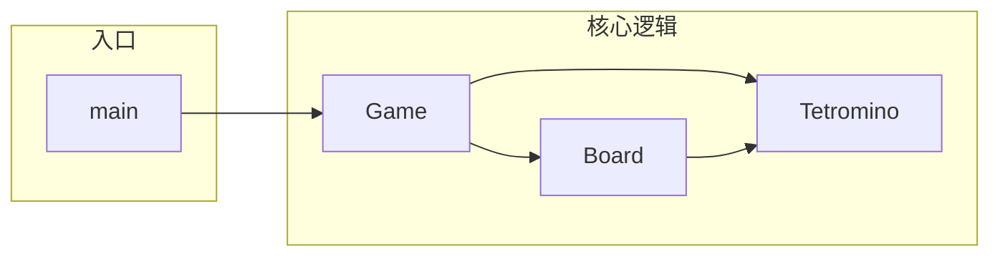

# 俄罗斯方块游戏与对应 MDC 规则设计计划

## 1. 技术选型与范围

- **运行环境**：Python 3.10+，使用 **pygame** 做窗口与渲染（便于完整“小游戏”体验）。
- **项目位置**：在仓库根目录下新增 `tetris/` 包与入口脚本，依赖写在 `requirements.txt`。
- **规则文件**：与现有 [.cursor/rules.general.mdc](.cursor/rules.general.mdc)、[.cursor/rules/python.mdc](.cursor/rules/python.mdc) 一致，将 Tetris 相关规则放在 `.cursor/` 下，命名为 `rules.tetris-*.mdc`（与现有 `rules.python.mdc` 命名风格统一）。

## 2. 类与模块划分




| 类/模块          | 职责                                                          |
| ------------- | ----------------------------------------------------------- |
| **Tetromino** | 七种方块形状数据、当前旋转状态、颜色；提供“按索引取形状矩阵”“顺时针/逆时针旋转”等接口。              |
| **Board**     | 二维网格（已固定格子）；落子、消行、碰撞检测（与当前下落块）、是否游戏结束。                      |
| **Game**      | 主循环、计时/下落速度、当前块与下一个块、左右移动/旋转/硬降、计分与等级、调用 Board 与 Tetromino。 |
| **main**      | 初始化 pygame、创建 Game、处理关闭与（可选）重启。                             |


- **常量/配置**：可在 `tetris/constants.py` 或 `tetris/__init__.py` 中集中定义（如网格行列数、块大小、颜色、初始速度等），供 Board/Game 使用。

## 3. 核心类设计要点（供实现与 MDC 引用）

- **Tetromino**
  - 七种形状用 4×4 或 3×3 矩阵表示（如 S/Z/L/J/I/O/T），每种 0°/90°/180°/270° 共 4 种形态，可预计算为静态数据。
  - 实例属性：当前形状索引、当前旋转索引、颜色；方法：`get_cells()`（返回相对坐标列表）、`rotate_clockwise()` / `rotate_counter_clockwise()`。
- **Board**
  - 内部：`grid: list[list[int|None]]`，用数字表示颜色索引或 None 表示空。
  - 方法：`place(tetromino, row, col)`、`clear_lines() -> int`、`collides(tetromino, row, col) -> bool`、`is_game_over() -> bool`、`merge(tetromino, row, col)`（落定后写入 grid）。
- **Game**
  - 状态：当前块、块位置、下一个块、分数、等级、下落计时器、是否结束。
  - 方法：`tick(dt)`（时间推进、自动下落）、`move_left/right()`、`rotate()`、`hard_drop()`、`spawn_next()`；绘制委托给 Board 与当前/下一个 Tetromino 的渲染（由 Game 或单独 draw 模块调用 pygame）。

## 4. 文件与目录结构

```
randomProject/
  tetris/
    __init__.py      # 包导出、可选常量
    constants.py     # 网格大小、颜色、速度等
    tetromino.py     # Tetromino 类及形状数据
    board.py         # Board 类
    game.py          # Game 类
    main.py          # pygame 初始化与 main()
  requirements.txt  # pygame>=2.5.0
  .cursor/
    rules.tetris-architecture.mdc   # 架构与模块职责
    rules.tetris-tetromino.mdc      # 方块形状与旋转
    rules.tetris-board.mdc          # 棋盘与消行
    rules.tetris-game.mdc           # 游戏主循环与状态
```

## 5. 每个设计对应的 MDC 规则文件

每个 `.mdc` 使用 YAML frontmatter（`description`、`globs`、`alwaysApply`），与 [.cursor/rules/python.mdc](.cursor/rules/python.mdc) 风格一致；`globs` 限定在 `tetris/**/*.py`，便于仅在修改俄罗斯方块代码时应用。


| 文件                                | 对应设计      | 内容要点                                                                                                                          |
| --------------------------------- | --------- | ----------------------------------------------------------------------------------------------------------------------------- |
| **rules.tetris-architecture.mdc** | 整体架构与模块划分 | 分层：Tetromino 无依赖 → Board 依赖网格与碰撞 → Game 协调 Board/Tetromino 与输入/时间；禁止 Game 直接改 grid，禁止在 Tetromino 里写 pygame；约定常量集中在 constants。 |
| **rules.tetris-tetromino.mdc**    | 方块形状与旋转   | 形状用 4×4 矩阵或等价坐标列表；旋转用预计算表或 90° 旋转变换；SRS 可选；颜色与形状一一对应；示例代码片段（取形状、旋转）。                                                          |
| **rules.tetris-board.mdc**        | 棋盘与消行     | grid 表示方式（行×列、空/非空）；碰撞检测基于当前块相对坐标与 board 边界/已固定块；消行从底向上、整行删除后下移；落定前先碰撞检测再 merge。                                              |
| **rules.tetris-game.mdc**         | 游戏主循环与状态  | 单入口 tick(dt)；输入处理与状态更新分离；当前块与下一块生成、死亡判定在 Board；计分/等级与下落速度的对应关系；不把 pygame 事件循环写进 Game 核心逻辑（便于测试）。                              |


每个 MDC 内容保持简洁（约 30–50 行），包含“做什么/不做什么”和 1–2 个简短代码示例或伪代码，不重复 [.cursor/rules/python.mdc](.cursor/rules/python.mdc) 中已有通用 Python 规范。

## 6. 实现顺序建议

1. **constants**：网格行列、块像素大小、颜色表、初始下落间隔、计分系数。
2. **Tetromino**：形状数据与 `get_cells()`、旋转方法；无 pygame 依赖。
3. **Board**：grid、`collides`、`merge`、`clear_lines`、`is_game_over`。
4. **Game**：状态字段、`spawn_next`、`tick`、移动/旋转/硬降、计分与等级、调用 Board/Tetromino。
5. **main**：pygame 窗口、事件循环、调用 `Game.tick()` 与绘制（可先在 Game 内实现简单 draw，或抽到 `tetris/render.py`）。
6. **四个 MDC**：按上表在实现完成后编写，确保规则与当前代码一致并可引用具体类/方法名。

## 7. 可选扩展（不纳入首版计划）

- 音效与背景音乐、暂停菜单、最高分持久化、SRS 旋转系统细节；若后续要做，可在对应 MDC 中补充“扩展”小节。

---

完成后，你将得到：可运行的 `python -m tetris.main`（或 `python tetris/main.py`）俄罗斯方块游戏，以及四个与设计一一对应的 `.cursor/rules.tetris-*.mdc` 规则文件，便于后续维护与 AI 在该子模块内遵循统一设计