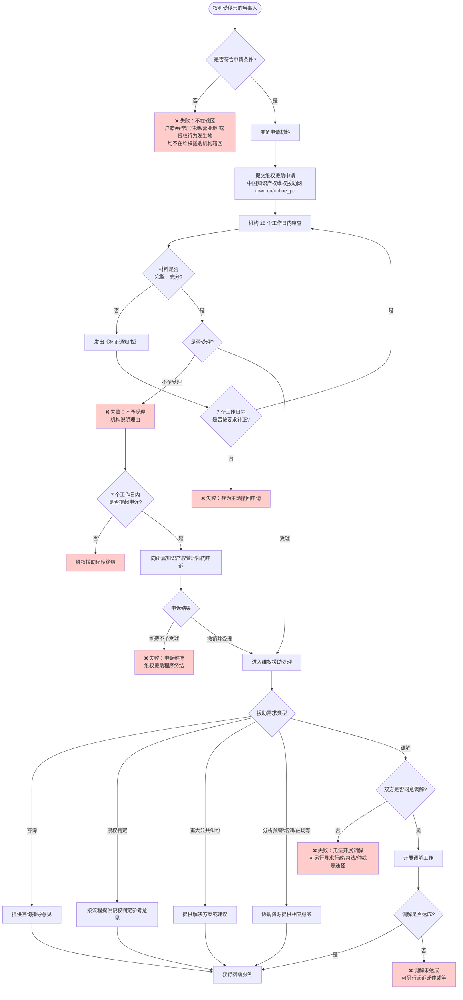

# 知识产权维权流程图（当事人视角）

依据：[辽宁省知识产权局 - 知识产权维权实务指引](https://zscq.ln.gov.cn/zscq/tzgg/2024092410214838895/index.shtml)

```mermaid
flowchart TD
    Start([权利受侵害的当事人]) --> Check{是否符合申请条件?}
    Check -->|否| Fail1[❌ 失败：不在辖区<br>户籍/经常居住地/营业地 或 侵权行为发生地<br>均不在维权援助机构辖区]
    Check -->|是| Prep[准备申请材料]
    
    Prep --> Submit[提交维权援助申请<br>中国知识产权维权援助网 ipwq.cn/online_pc]
    Submit --> Review[机构 15 个工作日内审查]
    
    Review --> MaterialOK{材料是否<br>完整、充分?}
    MaterialOK -->|否| Notice[发出《补正通知书》]
    Notice --> Supplement{7 个工作日内<br>是否按要求补正?}
    Supplement -->|否| Fail2[❌ 失败：视为主动撤回申请]
    Supplement -->|是| Review
    
    MaterialOK -->|是| Accept{是否受理?}
    Accept -->|不予受理| Fail3[❌ 失败：不予受理<br>机构说明理由]
    Fail3 --> Appeal{7 个工作日内<br>是否提起申诉?}
    Appeal -->|否| EndFail1[维权援助程序终结]
    Appeal -->|是| AppealResult[向所属知识产权管理部门申诉]
    AppealResult --> AppealOK{申诉结果}
    AppealOK -->|维持不予受理| Fail4[❌ 失败：申诉维持<br>维权援助程序终结]
    AppealOK -->|撤销并受理| Process
    
    Accept -->|受理| Process[进入维权援助处理]
    
    Process --> Type{援助需求类型}
    Type -->|咨询| C1[提供咨询指导意见]
    Type -->|侵权判定| C2[按流程提供侵权判定参考意见]
    Type -->|重大公共纠纷| C3[提供解决方案或建议]
    Type -->|分析预警/培训/驻场等| C4[协调资源提供相应服务]
    Type -->|调解| Mediate{双方是否同意调解?}
    
    Mediate -->|否| Fail5[❌ 失败：无法开展调解<br>可另行寻求行政/司法/仲裁等途径]
    Mediate -->|是| C5[开展调解工作]
    
    C1 --> EndOK[获得援助服务]
    C2 --> EndOK
    C3 --> EndOK
    C4 --> EndOK
    C5 --> MediateResult{调解是否达成?}
    MediateResult -->|是| EndOK
    MediateResult -->|否| Fail6[❌ 调解未达成<br>可另行起诉或仲裁等]
    
    style Fail1 fill:#fcc
    style Fail2 fill:#fcc
    style Fail3 fill:#fcc
    style Fail4 fill:#fcc
    style Fail5 fill:#fcc
    style Fail6 fill:#fcc
    style EndFail1 fill:#fcc
```
