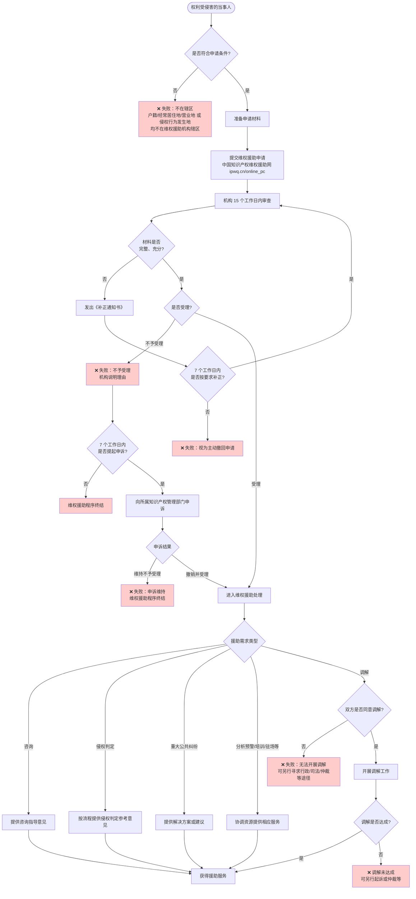

# 知识产权维权流程图（当事人视角）

> 依据：[辽宁省知识产权局 - 知识产权维权实务指引](https://zscq.ln.gov.cn/zscq/tzgg/2024092410214838895/index.shtml)

---

## 一、流程图（Mermaid）

---

## 二、失败节点汇总

| 节点 | 说明 | 对应依据 |
|------|------|----------|
| **失败①** | **不符合辖区条件**：申请人户籍地、经常居住地、营业地及侵权行为发生地均不在维权援助机构辖区，无法向该机构申请。 | 第三部分 申请条件 |
| **失败②** | **视为主动撤回**：收到《补正通知书》后，7 个工作日内未按要求补充或说明，视为主动撤回申请。 | 第四部分 受理程序 |
| **失败③** | **不予受理**：机构审查后决定不予受理并说明理由。 | 第四部分 受理程序 |
| **失败④** | **申诉维持**：对不予受理提起申诉后，知识产权管理部门维持不予受理决定，维权援助程序终结。 | 第四部分 受理程序 |
| **失败⑤** | **无法开展调解**：当事人申请/委托/委派调解，但对方不同意调解，无法开展调解。 | 第五部分 申请处理第 5 项 |
| **失败⑥** | **调解未达成**：双方同意调解但最终未达成一致，维权援助中的调解程序结束，需另行通过诉讼、仲裁等途径维权。 | 第五部分 申请处理第 5 项 |

---

## 三、申请前自检清单（降低失败概率）

- [ ] **辖区**：户籍地 / 经常居住地 / 营业地 **或** 侵权行为发生地，至少有一项在该维权援助机构辖区内。
- [ ] **材料**：已准备《知识产权维权援助申请表》、有效身份证明（或统一社会信用代码等）、事项与事由及证明材料、机构要求的其他材料，且完整、充分、真实。
- [ ] **补正**：若收到《补正通知书》，在 **7 个工作日内** 按要求补充或说明，避免被视为主动撤回。
- [ ] **申诉**：若对不予受理不服，在收到通知后 **7 个工作日内** 向该机构所属知识产权管理部门提起申诉。

---

## 四、辽宁省维权援助机构（申请入口）

| 机构 | 申请网址 | 电话 |
|------|----------|------|
| 辽宁省知识产权保护中心 | http://www.ipwq.cn/online_pc | 024-57819133 |
| 沈阳市知识产权保护中心 | http://www.ipwq.cn/online_pc | 024-23897719 |
| 大连市知识产权保护中心 | http://www.ipwq.cn/online_pc | 0411-84312999-1219 |
| 鞍山市知识产权维权援助中心 | http://www.ipwq.cn/online_pc | 0412-5723345 |
| 本溪市知识产权维权援助中心 | http://www.ipwq.cn/online_pc | 024-43618718 |

---

*流程图与失败节点整理自《知识产权维权实务指引》，具体以官方最新规定为准。*
